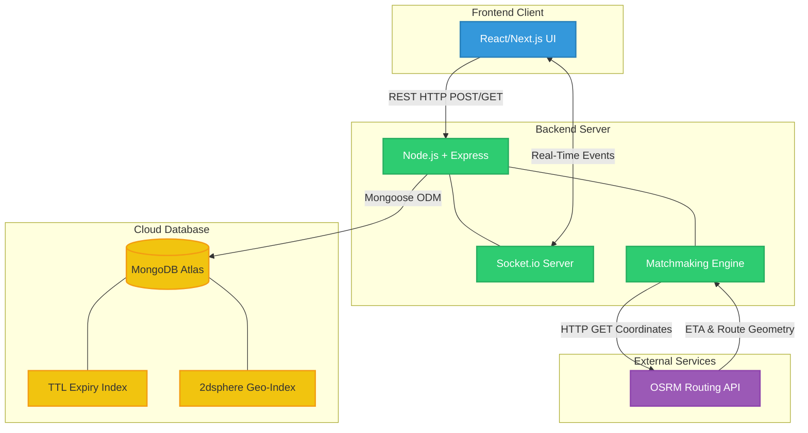
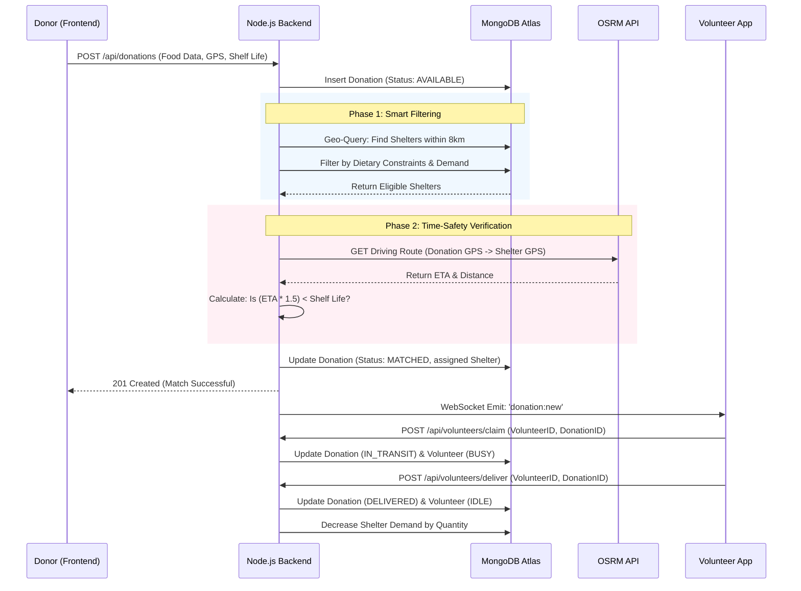

# RescueRoute Architecture & Flow Diagrams

This document contains Mermaid.js diagrams that you can use directly in your hackathon presentation or GitHub README. Many markdown viewers (like GitHub) render these automatically!

## 1. High-Level Architecture Diagram
This diagram shows the system components, technologies used, and how data moves between the client, backend, and external services.

---

## 2. Core User Flow (Donation Lifecycle)
This sequence diagram tracks exactly what happens from the moment a restaurant posts surplus food to the moment a volunteer delivers it. It highlights our intelligent matchmaking logic.

